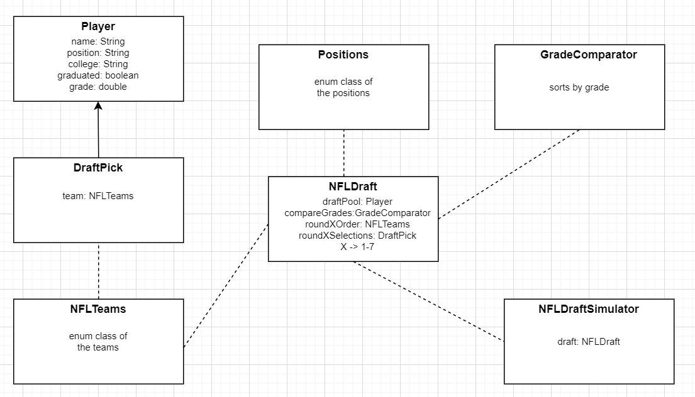

  

# NFL Mock Draft Simulator

A template mock draft program to help you perform a 7-round mock draft for a requested year. This particular simulator focuses on a simulation highly dependant on prospect's draft grade and position, in addition to a team's needs. Repository consists of the test on the 2020 NFL Draft data as an example and guide for performing past and future draft simulations. 

## Table of Contents
- [About](#about)
  - [How A Player Is Selected](#how-a-player-is-selected)
  - [Data Collection](#data-collection)
  - [Program Design](#program-design)
- [Usage](#usage)
- [Modifications](#modifications)
- [References](#references)

## About

### How A Player Is Selected

1. Run through each round and its draft order.
2. Scan a team's needs and collect players of those positions.
3. Player with the highest grade from those players is drafted by team
4. Continue until last pick

### Data Collection

Data collection is competely manual, which includes the grading of players, collecting of draft-eligible players, collecting of team needs, collecting of round order, etc. One may incorporate a non-manual way of collecting data as long as it remains in the same csv file formats, or else the simulator code must be modified. 

#### Players

The players can be grouped into the following positions: C, CB, DE, DT, FB, FS, ILB, K, LS, OG, OLB, OT, P, QB, RB, SS, TE, WR. Each position group is named to a csv file in the PreDraftData-NFLXXXX folder. The data on the players consist of name, college, graduated? (underclassman or not), and grade. Grades are manually provided to the each player. The 2020 test program utilizes a combination of the ESPN and DraftScout grading systems. No player can be in more than 1 file, as this will cause the player to possibly appear twice in the mock draft. 

#### Team Needs

Each team has its own text file of team needs, which can be placed/found in the TeamNeeds folder within the PreDraftData-NFLXXXX folder. The needs consists of the positions discussed in the players section. If a team needs multiple players of a position, the needs can be repeated twice or more in the list. The UpdatedTeamNeeds folder within the PostDraftData-NFLXXXX folder consists of the updated needs after the teams select. Once a position is fulfilled by a selection of a player, then the position is crossed out. 

#### Round Order

Each round has its own text file containing when each team is picking and at what pick number. These files are located in the PreDraftData-NFLXXXX folder along with the positions containing the players. 

### Program Design

## Usage

Files are named with the ending NFLXXXX, in which XXXX is the year. In the 2020 test program, one can see that the files end with NFL2020. Simply copy and past the PreDraftData-NFL2020 and PostDraftData-NFL2020 folders and replace 2020 with the year one would want to simulate. Go into each file and update stuff like needs and player data, but maintain the same format. If more factors other than position and grade are desired, then the position csv files must contain more columns and the program must be modified to take into account those factors. If you already have an accurate way of grading players or a grading system programmed, you can combine it with this simulator by having the grades output into the csv files in the right format. 

## References

[ESPN](https://www.espn.com/nfl/draft/news)

[DraftScout](https://draftscout.com/)
